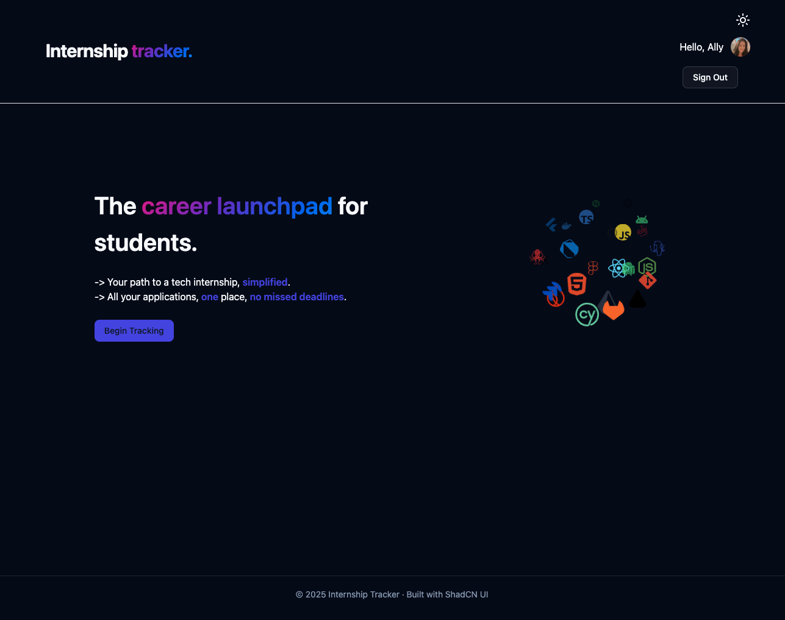
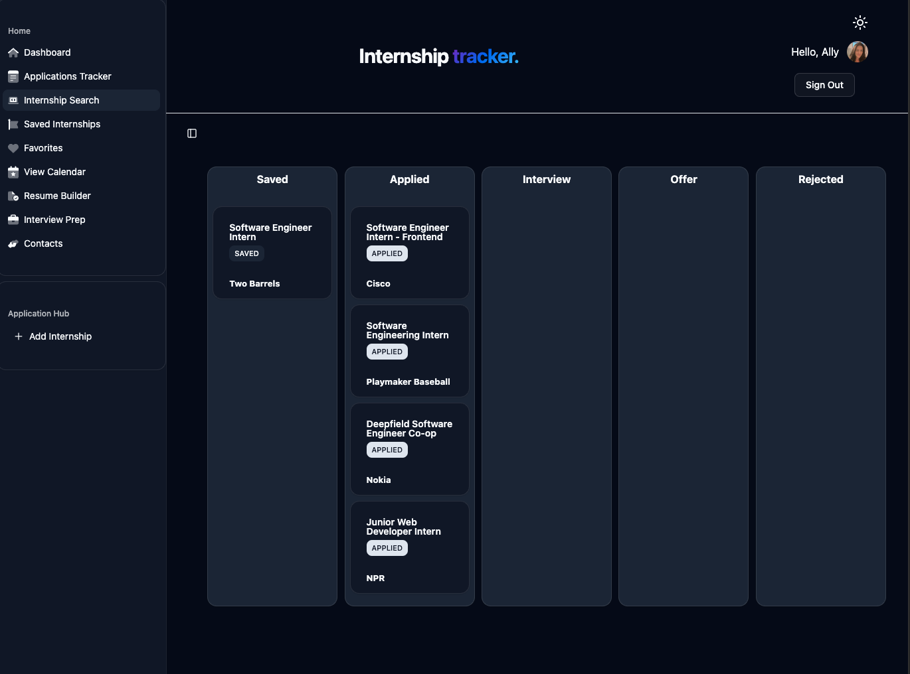
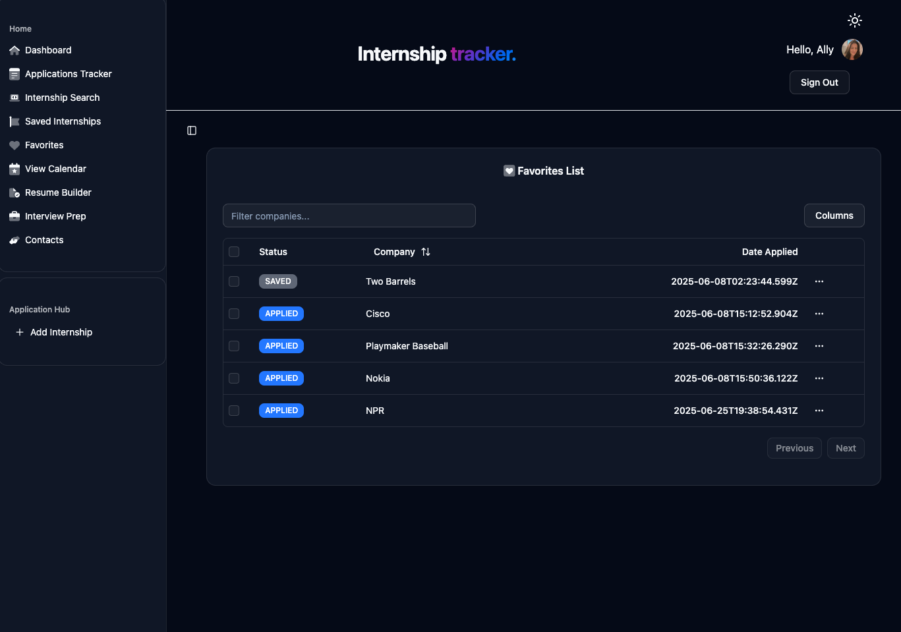
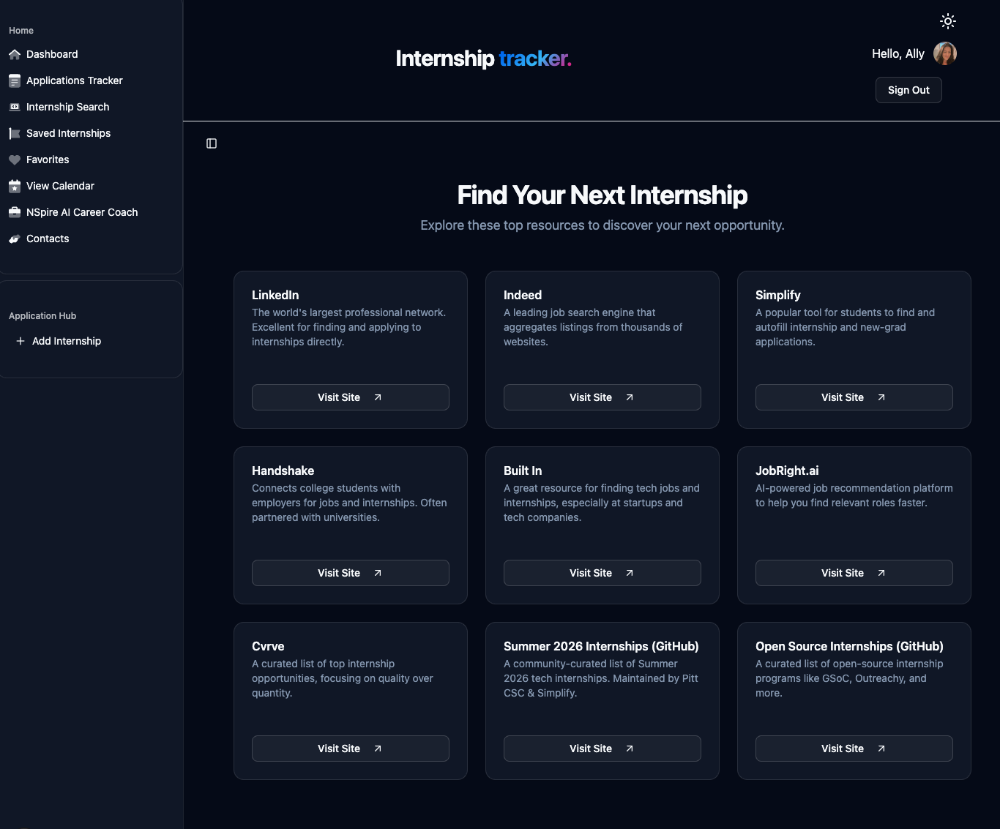
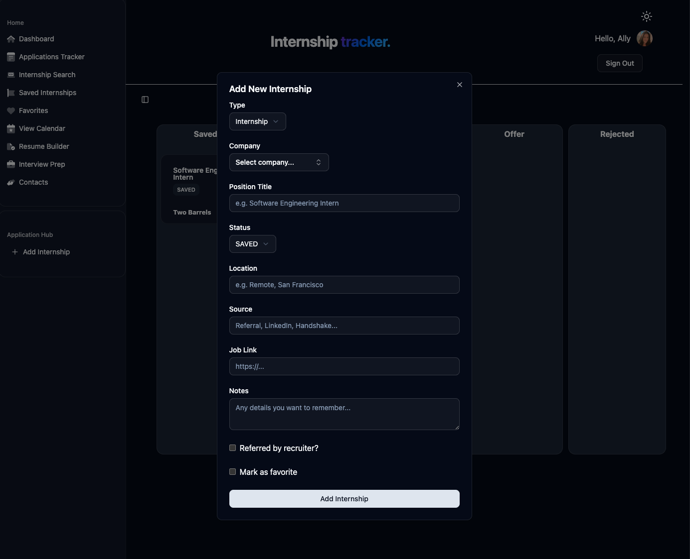

# Internship Tracker

⚡ **Internship Tracker** is a full-stack web app designed to help students and early-career professionals organize, track, and manage their internship, fellowship, and job applications. Built with **Next.js, TypeScript, Prisma, tRPC, ShadCN, and Auth.js**, it features a clean UI, drag-and-drop Kanban board, advanced filtering, and recruiter contact management.

## ✨ Features

- **Add, edit, and delete applications** — track status, recruiter contacts, and notes
- **Kanban-style board** — visually manage applications through different stages
- **Favorite applications** — mark top opportunities for easy reference
- **Dynamic filtering** — search and filter by company, status, and favorite
- **Company + recruiter database** — automatically create or select from existing
- **User authentication** — secure, personalized data with Auth.js
- **Responsive design** — works seamlessly on desktop and mobile

## 🛠 Current Tech Stack

- **Next.js** + **TypeScript**
- **Prisma ORM** + **PostgreSQL** database powerhouse
- **tRPC** API layer
- **ShadCN/UI** Tailwind CSS components
- **React Hook Form + Zod** for validation
- **Auth.js** + **GitHub OAuth** for authentication

## 📸 Screenshots

- [x] **Home Page**



- [x] **Tracker Page**



- [x] **Favorites Page**



- [x] **Search Internships Page**



- [x] **Add Internship Modal**



## 🚧 Current Status

This project is **actively in development**. Key features are implemented, and enhancements are ongoing — including ui and components, additional pages, analytics, automated reminders, and AI-based suggestions.

## 📂 Getting Started

Clone the repo:

```bash
git clone https://github.com/akeight/internship-tracker.git
cd internship-tracker
```

Install dependencies:

```bash
npm install
```

Run the dev server:

```bash
npm run dev
```

## 💡 Future Plans

- Edit analytics dashboard
- Add components to edit and delete applications for full CRUD processes
- AI-powered suggestions (e.g., resume tips, matching internships)
- Calendar view for application deadlines and push notifications

## 👀 Live Demo

Check for updates later!


## 🤝 Contributions

I welcome feedback, suggestions, and collaborators as I continue building this out!

---
