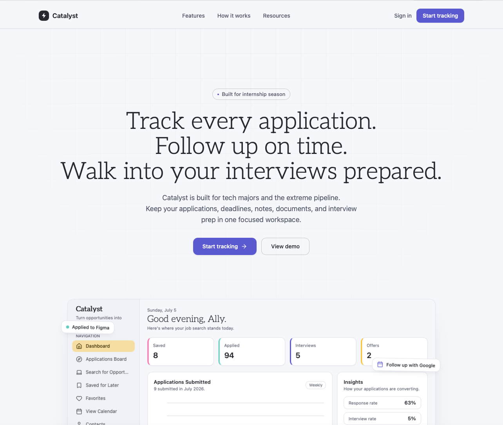
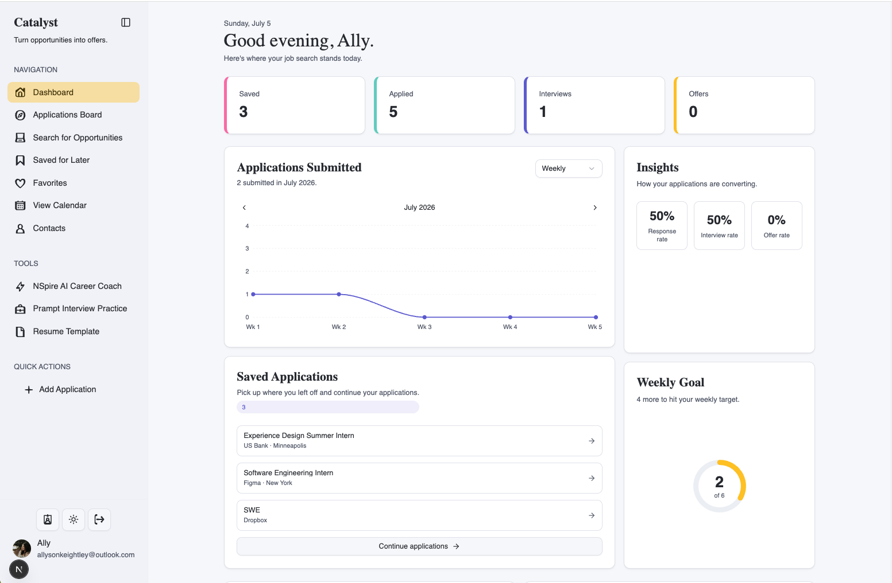
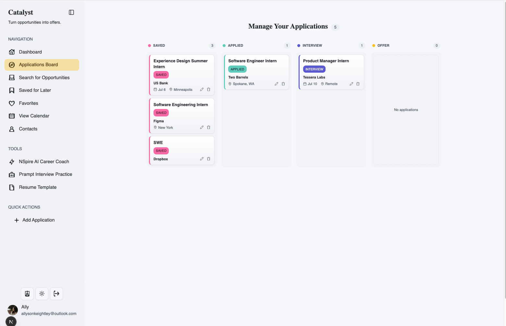
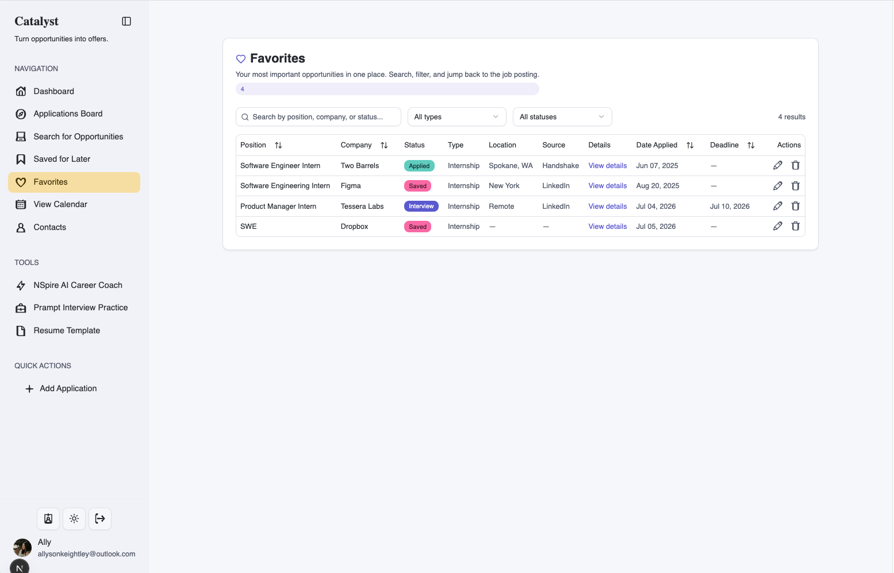
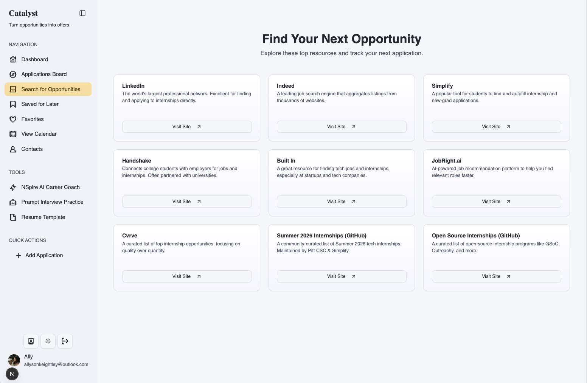
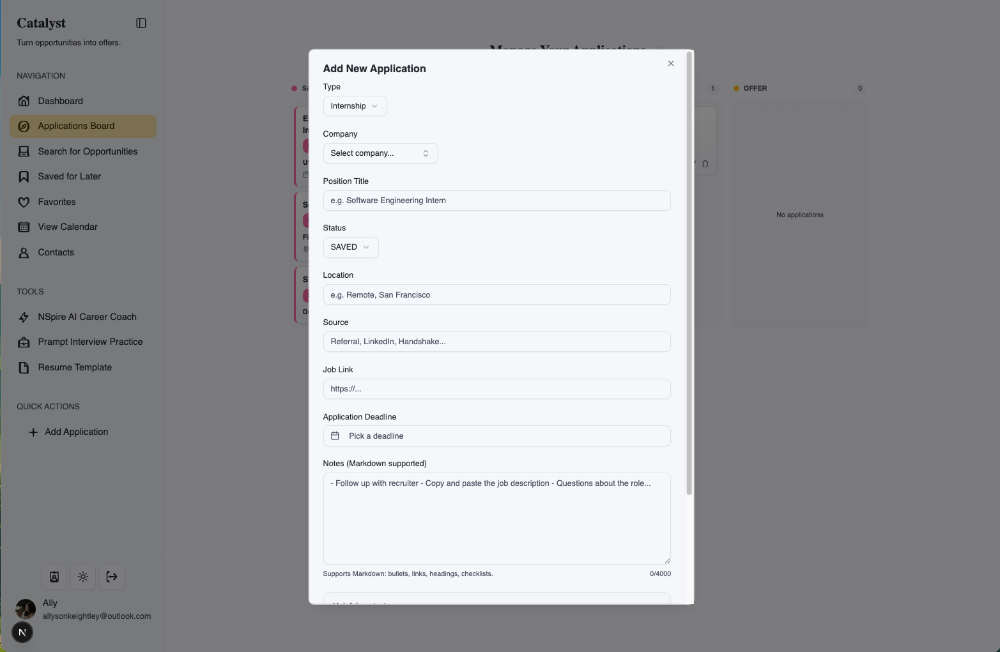

# Catalyst

## Turn opportunities into offers.

**Catalyst** is a full-stack web app designed to help students and early-career professionals organize, track, and manage their internship, fellowship, and job applications. Built with **Next.js, TypeScript, Prisma, tRPC, ShadCN, and Auth.js**, it features a clean UI, drag-and-drop Kanban board, advanced filtering, and recruiter/network contact management.

## Live Demo


## Features

- **User profile** - create goals, mananage weekly streak goals, upload resume
- **Add, edit, and delete applications** — track status, recruiter contacts, and markdown notes
- **AI generated company research** - interview prep with company overview, role analysis, recent developments, and questions tailor to role and company
- **Kanban-style board** — visually manage applications through different stages
- **Saved applications** — never lose track of the ones you don't finish
- **Favorite applications** — mark top opportunities for easy reference
- **Dynamic filtering** — search and filter by company, status, and favorite
- **Company + network database** — automatically create or select from existing
- **User authentication** — secure, personalized data with Auth.js
- **Responsive design** — works seamlessly on desktop and mobile

## Current Tech Stack

- **Next.js** + **TypeScript**
- **Prisma ORM** + **PostgreSQL** database powerhouse
- **tRPC** API layer
- **ShadCN/UI** Tailwind CSS components
- **React Hook Form + Zod** for validation
- **Auth.js** + **GitHub, Google, and LinkedIn OAuth** for authentication

## Screenshots

- [x] **Site Home Page**



- [x] **Dashboard Landing Page**



- [x] **Kanban Board Page**



- [x] **Favorites Page**



- [x] **Find Opportunities Page**



- [x] **Add Internship Modal**



## Current Status

This project is **actively in development**. Core product is built and ready for test users. Next up is to add analytics and expand on feature development.

## Getting Started

Clone the repo:

```bash
git clone https://github.com/akeight/careercatalyst.git
cd careercatalyst
```

Install dependencies:

```bash
npm install
```

Configure authentication environment variables:

```bash
AUTH_SECRET=
AUTH_URL=http://localhost:3000

GITHUB_CLIENT_ID=
GITHUB_CLIENT_SECRET=
GOOGLE_CLIENT_ID=
GOOGLE_CLIENT_SECRET=
LINKEDIN_CLIENT_ID=
LINKEDIN_CLIENT_SECRET=

# Local development only. Defaults are dev@example.com / password.
DEV_AUTH_EMAIL=dev@example.com
DEV_AUTH_PASSWORD=password
DEV_AUTH_NAME=Dev User
```

Run the dev server:

```bash
npm run dev
```

## Future Plans

- AI-powered suggestions (e.g., resume tips, matching internships)
- Calendar integrated with push notifications

## Contributions

I welcome feedback, suggestions, and collaborators as I continue building this out!

---
